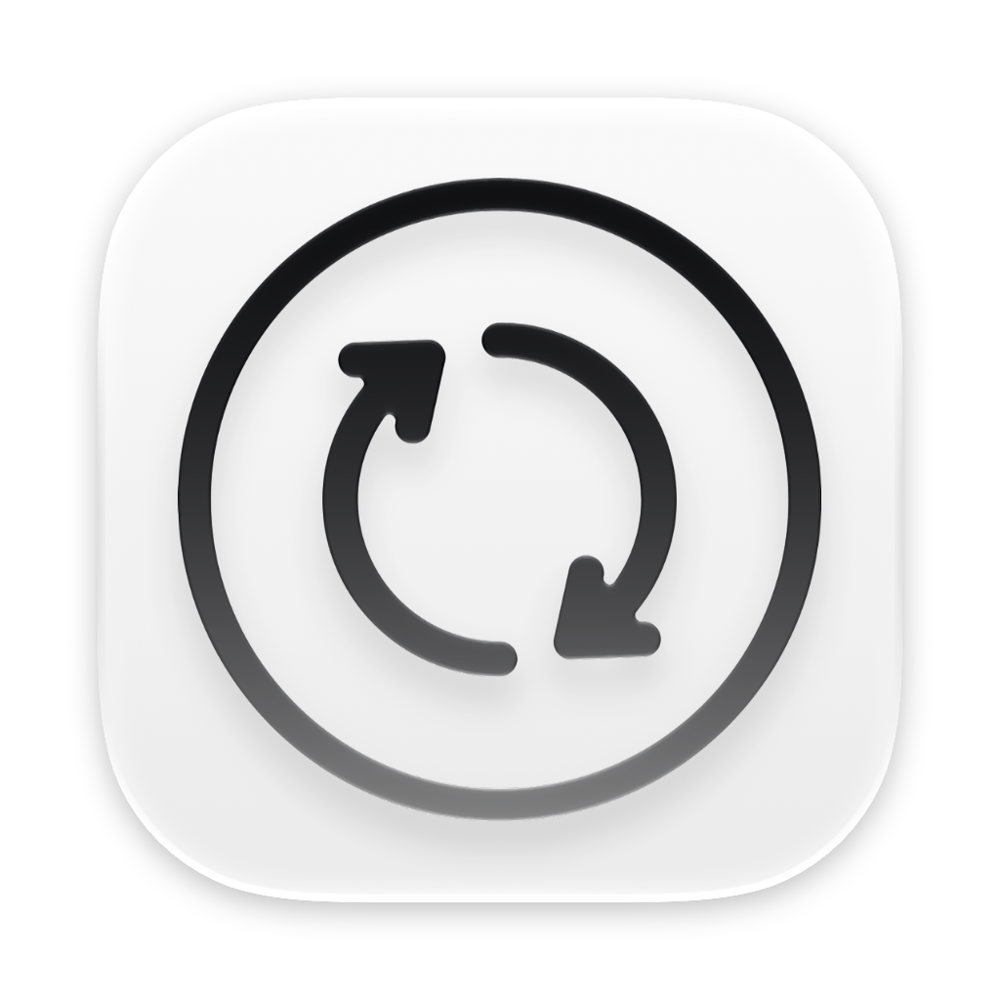
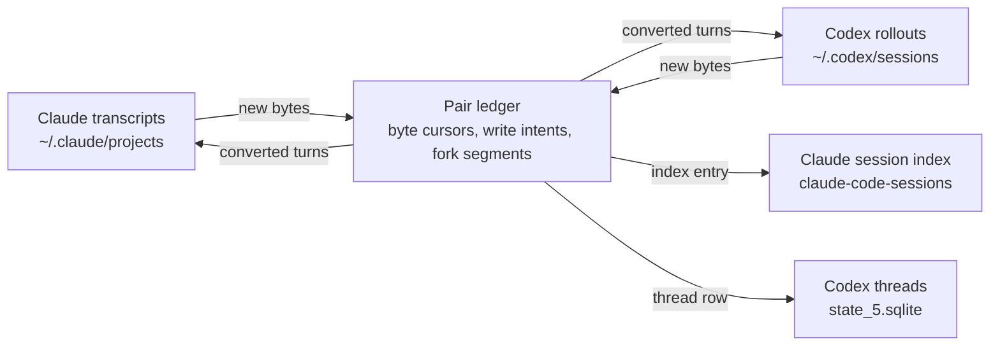

<div align="center">



# Claude Session Sync

**Keep every Claude Code session visible across Claude accounts, and mirror your chats between Claude Code and OpenAI Codex.**


</div>

---

Two separate annoyances turned into one app.

The first is an account problem. The Claude desktop app files its Claude Code session list per account, so the moment you switch login, every session recorded under the other account leaves the sidebar. The conversations are still on disk, but the app stops listing them.

The second is a tooling problem. Work started in Claude Code and work started in OpenAI Codex live in stores that never meet, even when both assistants are pointed at the same repository, on the same Mac, on the same afternoon. Moving a task from one to the other means retyping the context and losing the trail.

Claude Session Sync is a native macOS app that handles both. It reconciles the per-account session index so nothing vanishes from the sidebar, and it maintains a two way mirror between Claude Code sessions and Codex threads, with conflict handling, integrity checks, fork awareness and an opt-in auto sync that runs in the background from the menu bar.

Requirements: macOS 14 or later on Apple Silicon, the Xcode command line Swift toolchain to build. No package manager, no Electron, no browser runtime. One SwiftUI binary and the system `libsqlite3`.

---

## Why Claude Code sessions disappear after switching accounts

The Claude desktop app stores its session index partitioned by account:

```
~/Library/Application Support/Claude/claude-code-sessions/
├── <accountUuidA>/<orgUuid>/local_*.json     account A
└── <accountUuidB>/<orgUuid>/local_*.json     account B
```

On launch it reads only the folder belonging to the account you are signed into. Sessions recorded under any other account are still on disk, still complete, and completely invisible in the sidebar. Anthropic has [closed this as "not planned"](https://github.com/anthropics/claude-code/issues/48511), so it is settled behavior rather than a defect waiting for a patch.

The useful detail is what stays put. Transcripts are written to a location that is not partitioned by account:

```
~/.claude/projects/<encoded-working-directory>/<sessionId>.jsonl
```

That is why `claude --resume` in the terminal always sees everything while the desktop sidebar does not. Only the small `local_*.json` index files carry the account boundary: title, sort order, last opened timestamp, MCP configuration. Reconciling those files across accounts restores the full list, which is what the Accounts tab does.

### What the Accounts tab does

Every account under `claude-code-sessions/` is discovered and listed with its UUID, session count and last activity, with the most recently used one flagged as active. Each session is shown with the accounts that hold a copy, which copy leads, and a status of `in sync`, `diverging` or `missing`.

Sessions whose transcript was already removed by Claude's own cleanup are marked as orphaned. They still appear in the sidebar and still open empty, and no amount of syncing will bring them back. Labelling them keeps the difference between "out of date" and "gone" visible.

Reconciliation picks a winner per session, compared as a tuple of `lastActivityAt`, then `lastFocusedAt`, then file modification time. The tuple matters more than it looks: sessions you reopened without sending a message differ only in `lastFocusedAt`, so a comparison on activity alone would tie and hand the decision to iteration order.

Two fields resist the winner rule on purpose. `remoteMcpServersConfig` and `enabledMcpTools` reference MCP servers registered per account, and Claude empties them when a session is opened under an account that cannot resolve those UUIDs. If the winning copy has them empty while the destination still has them filled, the destination keeps its own values. A naive sync would quietly erase working MCP configuration. Everything else follows the winner, and `scheduled-tasks.json` is never touched at all, since it belongs to the account that scheduled the tasks.

Nothing is written before you open the plan and confirm. The preview lists exactly which sessions will be created or updated and in which direction.

---

## The Codex bridge

The Codex tab pairs each Claude Code session with a thread in OpenAI Codex, the coding surface inside the ChatGPT desktop app, and keeps both sides current in either direction.

A Claude session becomes a resumable Codex thread: a rollout JSONL file, a row in the `threads` table of `state_5.sqlite`, an entry in `session_index.jsonl`, and the workspace hints the ChatGPT app reads when you group chats by project. A Codex thread becomes a resumable Claude session: a transcript with a valid uuid chain plus a desktop index entry. Imported threads list and open in the ChatGPT app and resume with `codex exec resume`, and imported sessions appear in the Claude sidebar with their tool calls rendered natively.

After the first mirror, syncing is incremental. A byte offset cursor per side records exactly how far each file has been consumed, so only the new region is read, converted and appended. Identifiers are derived deterministically from the source session, which is what makes every operation idempotent: running a sync twice produces the same file, never a duplicate.

### What crosses, and what cannot

| Content | Claude to Codex | Codex to Claude |
| --- | --- | --- |
| User and assistant turns | preserved | preserved |
| Tool calls and results | bounded `[external_agent_tool_call]` tags with the key fields extracted | native `tool_use` and `tool_result` blocks |
| Plans, scripts, commands | preserved inside the tool tags | preserved inside the tool blocks |
| Model reasoning | dropped | dropped |
| Injected control payloads | filtered | filtered |

The Claude to Codex renderer follows OpenAI's own migration code, from turn identifiers to the closing import marker and token estimate, so imported chats read the way a natively imported chat reads. The reverse direction goes further than the tags: Codex `function_call` and `custom_tool_call` payloads become real Claude tool blocks, which is how MCP tools already render, with every call guaranteed a matching result. Missing outputs are synthesized during a full import, and an incremental sync waits rather than inventing one while a call is still open.

Reasoning is the one thing that genuinely does not travel. Codex writes its reasoning to disk encrypted, so nothing local can read it, including OpenAI's own exporter. Claude writes thinking blocks in clear text, but the API does not replay thinking from earlier turns when a session resumes, so carrying it across would preserve text that neither assistant would use. What the model actually acted on does cross: plan updates, commands, edits, and the messages themselves.

### Forks, branches and duplicate chats

Both assistants fork conversations, in different ways, and both used to produce twin chats on the other side.

Codex links continuation threads with `forked_from_id` and `parent_thread_id`, which is what happens when a long task crosses several git branch merges. The ChatGPT interface stitches those segments into one conversation, so the bridge does the same and syncs the whole chain into a single Claude session instead of a pile of fragments.

Claude forks in the opposite direction. Editing an earlier prompt makes the desktop app write a new transcript file, copying the ancestor lines verbatim with their original uuids and diverging at the edit point, while the previous file keeps the abandoned branch and its `[Request interrupted by user]` marker. Read naively, that new file looks like a brand new session. The engine recognizes the shared root uuid, re-links the existing pair to the fork, computes the divergence point from the uuid chain, and sends only the edited branch into the same Codex thread.

When duplicated mirrors already exist from before, the Codex tab detects them and offers consolidation. Divergent turns are merged into the thread that was minted natively, the duplicate thread is archived through the official app server RPC, the dead Claude session leaves the sidebar while its transcript stays on disk, and the ledger folds back to a single pair. Consolidation is only offered where the merge is provably lossless: a hidden session has to be a uuid verified fork ancestor of the one being kept, or an exact prefix of its user turns. Two halves of an account switch relic hold complementary content rather than duplicate content, so they are left alone.

### Finishing turns, conflicts, background sync

A session that is still being written shows as `working`, stays out of the menu bar badge, and is skipped by both manual and automatic syncs. That state is read from the file tail rather than from a timer, because a long tool call keeps a transcript silent for minutes while the turn is very much open. An unanswered prompt, a tool call without its result, or an open `task_started` all mean the same thing: wait. Turns left dangling for more than ten minutes are treated as abandoned so a dead session cannot block syncing forever.

If both sides advanced since the last sync, the pair is flagged as a conflict and counted in the badge. Nothing is resolved automatically. You choose the winning side, its new turns are mirrored, and the losing side keeps its own turns in its own transcript, recorded in the ledger as a skipped range rather than deleted.

Auto sync is opt-in. One FSEvents stream watches both session trees, a per session quiet period (20 seconds by default, adjustable) marks the end of a reply, and the pair syncs itself. Writes made by the engine are suppressed at the watcher so it never reacts to its own output. With the window closed the app keeps running in the background, and the menu bar shows a live count of what is waiting.

---

## Inside the sync engine



The ledger at `~/Library/Application Support/ClaudeSessionSync/codex-links.json` is the only piece of state the app owns. It holds one record per pair: the two identifiers, the two file paths, a cursor per side, the uuid the next appended line should attach to, the deterministic counters that keep conversions reproducible, fork segments, retired ancestors, and any range that a conflict resolution deliberately skipped. It is written atomically through a temporary file, an fsync and a rename, keeping one previous generation as a backup, and every read modify write cycle is serialized by an advisory lock so two processes cannot overwrite each other.

Before any append, the engine records a write intent: target file, offset, length and payload hash, flushed to disk first. If the app is killed mid write, the next launch hashes that byte range and reaches one of three conclusions: the write landed and the carried post state is applied verbatim, the write never started and the intent is dropped, or the result is ambiguous and the pair is held for review rather than guessed at.

Verify runs a read only structural check across every pair: uuid chains on the lines the engine wrote, tool call and result pairing with an allowance for a tail still in flight, rollout identity and turn balance, cursor coherence against real file sizes on disk. Running it after a round trip is the cheapest way to confirm that a chat which crossed both ways is still structurally intact.

---

## Safety model

Writing runs begin with a timestamped backup: the Codex database copied through `VACUUM INTO` with the SQLite online backup API as fallback, the session index, the ledger, and the Claude session index. Three runs are kept and older ones are pruned inside their own namespace with a path prefix check.

Transcripts and rollouts are only ever appended to, never rewritten, each with a one generation `.css-bak` beside it. Appends verify that the file still ends where the intent said it did, so a native writer landing a turn in the same instant cancels the round instead of poisoning a cursor. Index files are written atomically. A schema version guard disables Codex side writes if the ChatGPT app changes its database format, which is a real possibility given that the format is still alpha, and reading keeps working in the meantime.

The app itself makes no network requests. The only process it talks to is the local `codex app-server`, used for archiving threads, because writing `archived = 1` straight into sqlite gets reverted by the ChatGPT app on its next launch.

---

## Build and run

```sh
git clone https://github.com/lavderenterprise/claude-sync.git
cd claude-sync
./build.sh
open ClaudeSessionSync.app
```

`build.sh` compiles the icon with `actool`, builds the sources into an app bundle with its `Info.plist`, and applies an ad hoc signature, without which macOS refuses to launch the binary on Apple Silicon.

The icon is authored in Apple Icon Composer and lives at `Icon/AppIcon.icon`. At build time `actool`, Apple's own asset compiler, renders it into the `Assets.car` that macOS 26 draws as a Liquid Glass icon, plus a flat `AppIcon.icns` for older systems. It is never hand converted, so changing it means editing the `.icon` bundle and rebuilding.

---

## Where the data lives

Claude Code:

| Path | Role |
| --- | --- |
| `~/.claude/projects/<project>/<sessionId>.jsonl` | Transcripts, one JSON object per line, linked by `uuid` and `parentUuid` |
| `~/Library/Application Support/Claude/claude-code-sessions/<account>/<org>/local_*.json` | Per account session index: title, timestamps, MCP configuration |

OpenAI Codex:

| Path | Role |
| --- | --- |
| `~/.codex/sessions/<yyyy>/<mm>/<dd>/rollout-*.jsonl` | Rollouts: session metadata, events and response items |
| `~/.codex/archived_sessions/` | Where a rollout moves when its thread is archived |
| `~/.codex/state_5.sqlite` | `threads` table, the list the ChatGPT app renders |
| `~/.codex/session_index.jsonl` | Secondary index kept alongside the database |

`CODEX_HOME` is honored the same way the `codex` CLI honors it, so a relocated Codex home is picked up without configuration.

This app:

| Path | Role |
| --- | --- |
| `~/Library/Application Support/ClaudeSessionSync/codex-links.json` | Pair ledger |
| `~/Library/Application Support/ClaudeSessionSync/backups/` | Timestamped backups, last three runs |

---

## Project layout

```
Sources/App.swift                 Scene, app delegate for background lifecycle, tab shell
Sources/AppModel.swift            App scoped root model: watcher wiring, auto sync, badge
Sources/ClaudeSessionSync.swift   Accounts engine: index scan, winner rule, merge, backup, sync
Sources/UI.swift                  Accounts tab views
Sources/CodexModel.swift          Pair model, states, sync report, user facing errors
Sources/LinkStore.swift           Pair ledger: cursors, write intents, atomic persistence, lock
Sources/ClaudeStore.swift         Claude side: streaming JSONL reader and writers, fork forensics
Sources/CodexStoreIO.swift        Codex side: rollout I/O, threads table, templates, UI state
Sources/Conversion.swift          Both converters and the deterministic identifier scheme
Sources/SyncEngine.swift          Scan, change detection, executors, conflicts, consolidation, doctor
Sources/SQLiteLite.swift          SQLite wrapper and live database backup
Sources/AppServerRPC.swift        JSON-RPC client for codex app-server
Sources/Watcher.swift             FSEvents stream and quiescence debouncer
Sources/MenuBar.swift             Menu bar extra: badge and quick sync
Sources/CodexStore.swift          Codex tab store
Sources/CodexUI.swift             Codex tab views and sheets
Sources/SettingsUI.swift          Settings: auto sync, quiet period, menu bar, login item
Icon/AppIcon.icon                 App icon, authored in Apple Icon Composer
build.sh                          Icon compilation, bundling, signing
```

Engine code never imports SwiftUI and view code never touches disk. Anything that reads or writes lives in the store and engine files, and the `*UI.swift` files only present what those produce.

---

## Questions worth answering

**Do I need both apps installed?** The Accounts tab only needs Claude. The Codex tab needs `~/.codex` to exist, which means opening Codex in the ChatGPT app at least once.

**Do I have to restart anything after a sync?** Yes, and the app tells you which side. Both desktop apps read their session lists at launch and cache them, so a running app will not show imported chats, and the Claude app can overwrite index files you just reconciled.

**Can a sync lose messages?** The design answer is no: appends only, backups first, write intents around every append, conflicts held for a manual decision, skipped ranges recorded rather than dropped. The honest answer is to run Verify after a round trip, which is exactly what it is for.

**Why does an imported chat contain a marker line?** OpenAI's importer closes a migrated conversation with `<EXTERNAL SESSION IMPORTED>` and a token estimate. Imports here follow the same shape, and those markers are filtered on the way back so they never bounce between the two apps.

**What happens if the ChatGPT app changes its database?** Codex side writes stop and a notice appears, with reading and Claude side syncing unaffected, until the app is updated for the new schema.

**Is anything sent anywhere?** No. Everything happens between local files, and transcript contents never leave the machine.

---

## License

MIT. It edits files under `Application Support` and inside `~/.claude` and `~/.codex`, and while it backs up before every write, you run it at your own risk.
